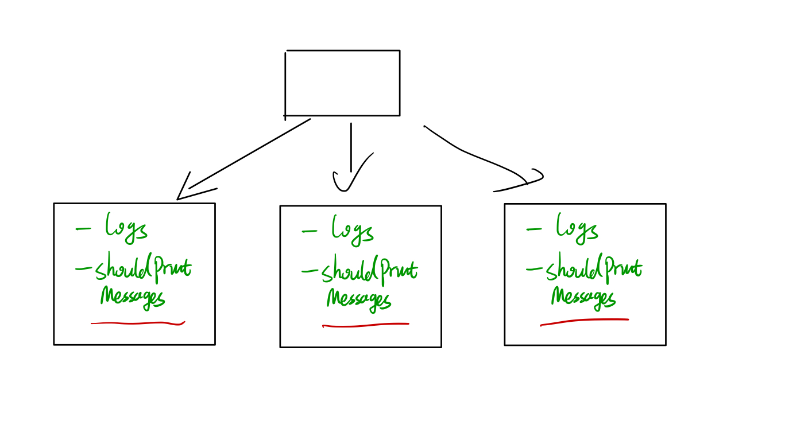

```javascript
/**
 * Initialize your data structure here.
 */
var Logger = function() {
    this.logs = {};
    
};

/**
 * Returns true if the message should be printed in the given timestamp, otherwise returns false.
        If this method returns false, the message will not be printed.
        The timestamp is in seconds granularity. 
 * @param {number} timestamp 
 * @param {string} message
 * @return {boolean}
 */
Logger.prototype.shouldPrintMessage = function(timestamp, message) {
    if (this.logs.hasOwnProperty(message) && (timestamp - this.logs[message] < 10)) {
        return false;
    }
    this.logs[message] = timestamp;
    return true;
};

/** 
 * Your Logger object will be instantiated and called as such:
 * var obj = Object.create(Logger).createNew()
 * var param_1 = obj.shouldPrintMessage(timestamp,message)
 ```

注意这里面是声明了一个 `constructor`, 一般的规则是如果一个函数的名字首字母是大写的 (在ES5中)，那我们就把他当作一个 `constructor`
使用的方法如下 

```javascript

var Person = function(name, age) {
    this.name = name; // 注意 这里的 this 指向的是 new Person() 的那个 instance
    this.age = age;
}

// 使用方法如下
var zml = new Person('zml', 18);
console.log(zml.name); // 'zml'
console.log(zml.age); // 18
```

然后这里有一个奇怪的expression

```javascript
Logger.prototype.shouldPrintMessage = function(timestamp, message) {
    if (this.logs.hasOwnProperty(message) && (timestamp - this.logs[message] < 10)) {
        return false;
    }
    this.logs[message] = timestamp;
    return true;
};
```
这里面需要知道的知识是  _原型链_,  [prototype](https://developer.mozilla.org/en-US/docs/Web/JavaScript/Inheritance_and_the_prototype_chain).

简单来说，JavaScript 中的 inheritance 是通过 object 的 prototype chain 来进行的

```javascript

var animal = {
    name: 'kitty',
    roar: function() {
        console.log('I am ' + this.name); // this 指向这个 animal 这个object
    }
}

var cat = Object.create(animal) // 自己查看 Object.create 的文档，简单来说是生成一个 cat object inherits from animal

p.name = 'ugly'; // creates an own property name on p;
console.log(p.roar()); // I am ugly;
// 首先，在 p 的object 中找 roar method， 找不到，然后他就往上一个 inheritance chain 的 object 中 找，
// 在 animal 中找到了 roar
// 在运行 roar() 时，找 this.name 的值。由于我们 invoke method 的context 是 cat,
// 所以他在 cat 中找到的 name 是 ugly

```


在 JavaScript 中，给 constructor 声明 methods 往往是在 constructor 的 prototype上面声明。这样我们在 `new Constructor()` 的时候是这样的，
以上面的 `Logger` 为例


如果我们不在 prototype 上面声明会是什么样呢？


我们看到每个新的 instance 都包含有同样的 methods, 但是每个method 又都是相同的，这样就造成了内存的浪费。所以`Logger.prototype.method = function(){}` 才是正确的姿势

详情可以看 javascript for web developer 中的 Chapter 6, inheritane